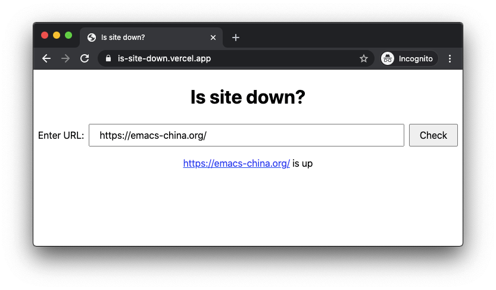

# Is site down?

Check if a website is down by sending a HTTP HEAD request, if the website
responses within 3 seconds, it's up, otherwise, it's down.

https://is-site-down.vercel.app/



## API

For example, https://is-site-down.vercel.app/api/check?url=https://emacs-china.org/

```
$ curl 'https://is-site-down.vercel.app/api/check?url=https://emacs-china.org/'
{
  "isDown": false,
  "url": "https://emacs-china.org/",
  "reason": "HEAD request responded with 200"
}
```

The CORS is enabled.
